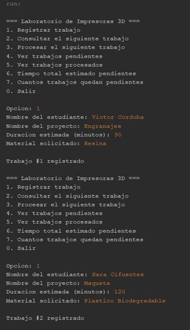
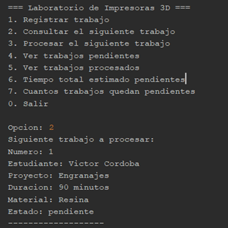
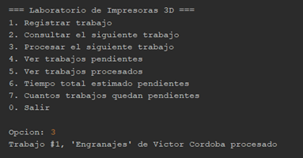
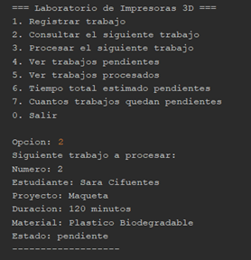
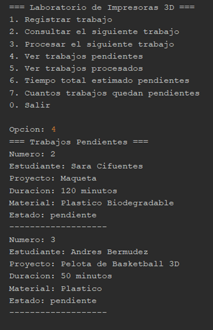
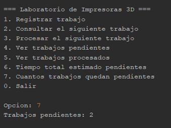
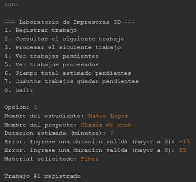
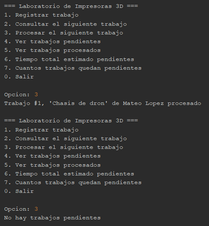

# Sistema de Gestión del Laboratorio de Impresoras 3D - Estructura de Datos

Este proyecto es una aplicación desarrollada en **Java** para la automatización y administración logística de las colas de impresión en el laboratorio 3D de la universidad, empleando estructuras de datos lineales para asegurar un control de turnos eficiente y equitativo.

### 📂 Ubicación del Código
El código fuente principal con toda la lógica del programa se encuentra en la siguiente ruta:
`src > estructura32 > Estructura32.java`

### 🛠️ Detalles de la Implementación
* **Estructura de Datos:** Implementación de una `Queue` (Cola) utilizando `LinkedList` para gestionar las solicitudes bajo el principio FIFO (First In, First Out), garantizando el respeto estricto al orden de llegada de los estudiantes.
* **Historial de Procesados:** Uso de una `LinkedList` para almacenar de forma cronológica y ordenada los proyectos de impresión que ya fueron completados con éxito.
* **Modelado de Datos:** Creación de una clase interna `Trabajo` para encapsular los atributos esenciales de cada orden (número, estudiante, proyecto, duración, material y estado), promoviendo un código modular.
* **Validación de Dominio:** Inclusión de un filtro condicional que impide el registro de proyectos con tiempos de duración menores o iguales a cero, protegiendo la coherencia de las métricas.
* **Gestión de Errores:** Control preventivo del flujo mediante `isEmpty()` para evitar excepciones al intentar procesar sobre una cola vacía, complementado con un bloque `try-catch` para manejar la excepción `InputMismatchException` ante entradas inválidas en el menú.
* **Lógica de Recorrido Seguro:** Uso de una cola auxiliar temporal para calcular el tiempo total de espera y listar los pendientes, permitiendo extraer y analizar los datos sin destruir la estructura ni alterar la posición original de los turnos.

> **Nota para el profesor:** He subido el proyecto completo a este repositorio de GitHub para garantizar la visualización del código con total claridad y complementar la documentación técnica entregada.

---

## 💻 Capturas de la Implementación (Consola)

A continuación se muestran las pruebas de ejecución del sistema, demostrando las operaciones de registro, procesamiento, visualización de pendientes y manejo de errores:

### Imagen 1: Registro de trabajos

### Imagenes 2, 3 y 4: Consultas y procesamient

### Imagenes 5 y 6: Visualización de trabajos pendientes y totales

### Imagenes 7 y 8: Validación de errores 

---
**Desarrollado por:** Victor Manuel Cordoba Larez
**Carrera:** Ingeniería Informática
**Materia:** Estructura de Datos
**Institución:** Corporación Universitaria Lasallista
